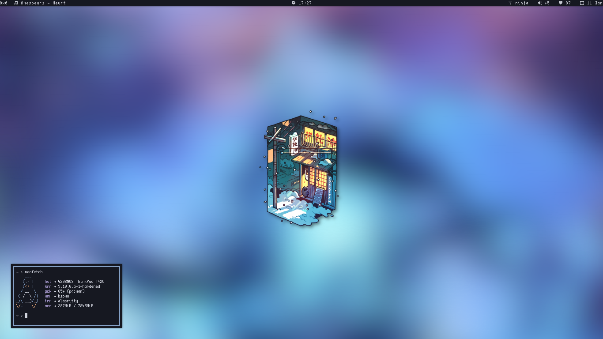
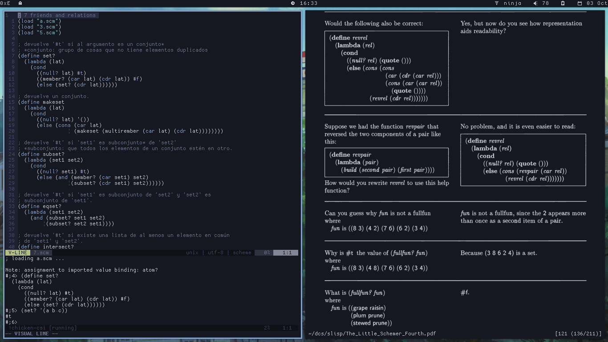

#### dotfiles



##### install

Managed with GNU `stow`.

Clone the repository and symlink programs to the `$HOME` directory. Example:

```
$ stow -t ~ vim tmux bash
```

##### uninstall

Remove the symlinks. Example:

```
$ stow -t ~ -D vim tmux bash
```

##### stuff i use

| :( :( :( :(  | software                          |
|--------------|-----------------------------------|
|distribution  |[Arch Linux](https://archlinux.org)|
|window manager|`bspwm`|
|terminal      |`alacritty`|
|launcher      |`rofi`|
|panel/bar     |[`lemonbar-xft`](https://github.com/krypt-n/bar)|
|notifications |`dunst`|
|file manager  |`nnn` (and `thunar` sometimes)|
|editor        |`nvim`|
|music player  |`ncmpcpp` (`mpd` client)|
|multiplexer   |`tmux`|
|reader        |`zathura`|
|image viewer  |`feh`|
|compositor    |`picom`|
|browser       |`firefox`|
|fonts         |[terminus](http://terminus-font.sourceforge.net/)|
|colorscheme   |[onedark](https://github.com/joshdick/onedark.vim)|
|gtk theme     |[arc](https://github.com/jnsh/arc-theme)|
|gtk icons     |[papirus](https://github.com/PapirusDevelopmentTeam/papirus-icon-theme)|
|screen locker |[`slock`](https://github.com/cer-0/suckless/tree/iceberg/slock) (fork)|

##### dependencies:

Check the [dependencies wiki](https://github.com/cer-0/dots/wiki/Dependencies) page.


`tmux`, `nvim` and `feh`.
