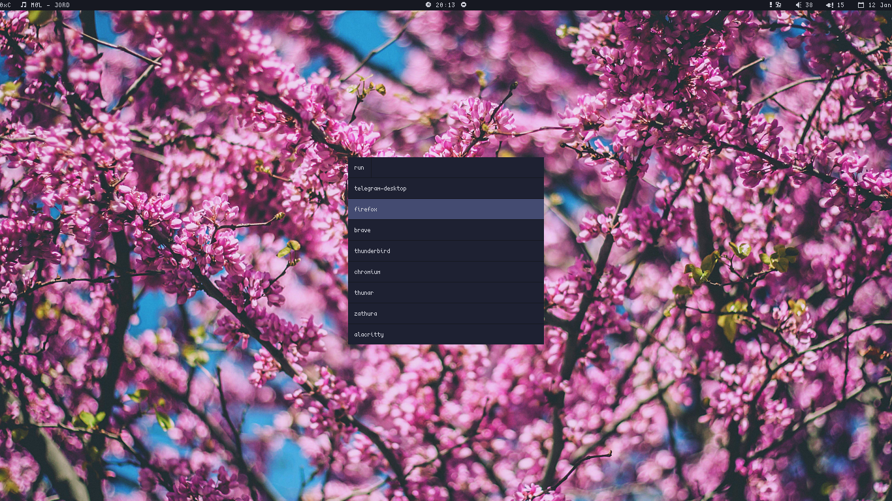

# dotfiles

Managed with GNU `stow`.

For symlinking some programs to the `~` directory just run:

```
$ stow -t ~ vim tmux bash
```

For removing:

```
$ stow -t ~ -D vim tmux bash
```

---
software:

- window manager: `bspwm`

- terminal: `alacritty`

- launcher: `rofi`

- panel/bar: `lemonbar`

- notifications: `dunst`

- file manager: `nnn` (and `thunar` sometimes)

- editor: `vim`

- music player: `ncmpcpp` (as a frontend for `mpd`)

- multiplexer: `tmux`

- reader: `zathura`

- image viewer: `feh`

- compositor: `picom` (fork of `compton`)

- browser: `firefox`

---
Screenshots:



