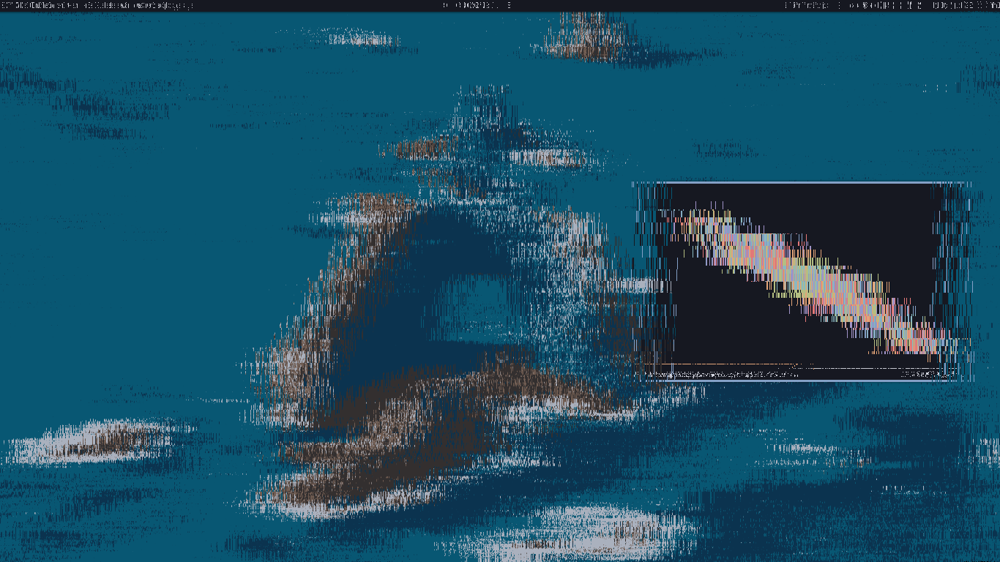

#### dotfiles


##### install

Managed with GNU `stow`.

Clone the repository and symlink programs to the `$HOME` directory. Example:

```
$ stow -t ~ vim tmux bash
```

##### uninstall

Remove the symlinks. Example:

```
$ stow -t ~ -D vim tmux bash
```

##### stuff i use

- distribution: [arch](https://archlinux.org)
- window manager: `bspwm`
- terminal: `alacritty`
- launcher: `rofi`
- panel/bar: [`lemonbar-xft`](https://github.com/krypt-n/bar)
- notifications: `dunst`
- file manager: `nnn` (and `thunar` sometimes)
- editor: `vim`
- music player: `ncmpcpp` (`mpd` client)
- multiplexer: `tmux`
- reader: `zathura`
- image viewer: `feh`
- compositor: `picom` (fork of `compton`)
- browser: `firefox`
- fonts: [scientifica](https://github.com/NerdyPepper/scientifica), [lemon](https://github.com/cmvnd/fonts) and [siji](https://github.com/stark/siji) as icons
- colorscheme: [iceberg](https://github.com/cocopon/iceberg.vim)
- gtk theme: adwaita
- gtk icons: [boston](https://github.com/heychrisd/Boston-Icons) and [papirus](https://github.com/PapirusDevelopmentTeam/papirus-icon-theme)
- screen locker: my fork of [`slock`](https://github.com/cer-0/suckless/tree/iceberg/slock)

##### dependencies:

Names of the packages (for Arch Linux):

```
# sys
xorg xorg-xinit iwd
# wm
bspwm sxhkd alacritty rofi dunst picom xdo
# cli
vim git tmux stow
# bin
main xclip xdotool tree qrencode
# audio
alsa-utils pulseaudio pulsemixer
# media
nnn ncmpcpp mpd mpc mpv feh zathura zathura-pdf-mupdf
# fonts
noto-fonts-emoji noto-fonts-cjk terminus-font
# opt
firefox irssi telegram-desktop pass thunar papirus-icon-theme
```

##### (AUR) dependencies:

I always forget these, and they're kinda critical

```
lemonbar-xft wmutils xtitle scientifica siji boston 
```

##### more screenshots:


trying to solve day 4 of [aoc](adventofcode.com). `tmux`, `vim` and `firefox`.


`rofi`.


`slock`.
